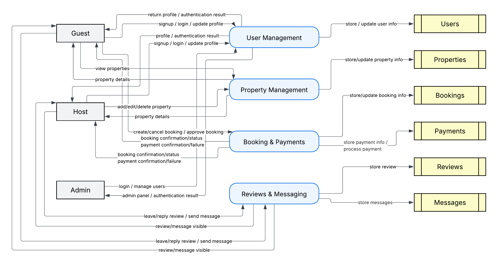

# Data Flow Diagram (DFD)

This directory contains the **Data Flow Diagram (DFD)** for the Airbnb Clone project.

The DFD illustrates how data moves through the system between users, processes, and data stores. It focuses on the core backend operations such as authentication, property management, booking, payments, and reviews.

## Diagram Overview

**Entities (External):**

* Guest
* Host
* Admin

**Processes:**

1. User Management
2. Property Management
3. Booking & Payments
4. Reviews & Messaging

**Data Stores:**

* Users
* Properties
* Bookings
* Payments
* Reviews
* Messages

## Description

1. **User Management:** Handles user registration, login, profile updates, and account authentication.

   * Data moves between *Guest/Host/Admin* and the *Users* data store.

2. **Property Management:** Manages property listings including creation, modification, and deletion by hosts.

   * Exchanges data between *Hosts*, *Guests*, and the *Properties* data store.

3. **Booking & Payments:** Controls booking creation, approval, and cancellations, and handles payment operations.

   * Interacts with *Bookings* and *Payments* data stores.

4. **Reviews & Messaging:** Allows guests and hosts to post reviews and send messages.

   * Communicates with *Reviews* and *Messages* data stores.