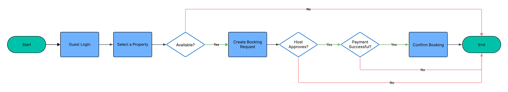

# Property Booking Flowchart

This directory contains the **flowchart** for the **Property Booking** process of the Airbnb Clone backend.

The flowchart visualizes the step-by-step workflow for booking a property, including decisions for availability, host approval, and payment.

## Flowchart Overview

**Processes:**

1. Guest Login / Authentication
2. Select Property
3. Check Property Availability
4. Create Booking Request
5. Host Approves or Declines
6. Process Payment
7. Confirm Booking

**Decisions (Diamonds):**

* Check Property Availability (Yes → continue, No → End)
* Host Approves? (Yes → Payment, No → End)
* Payment Successful? (Yes → Confirm Booking, No → End)

**Start / End:** Rounded rectangles (ovals)

**Processes:** Rectangles

**Decisions:** Diamonds