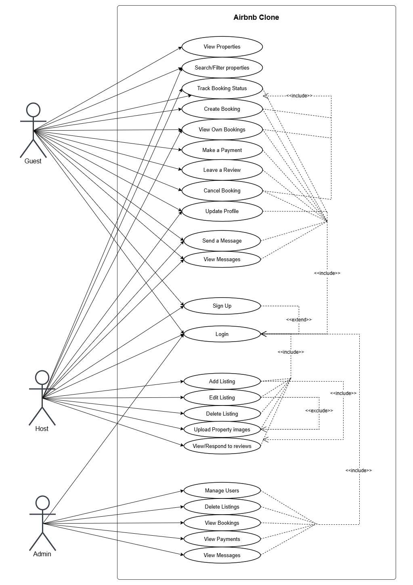

# Use Case Diagram Explanation

The Use Case Diagram represents the interaction between the three actors (**Guest**, **Host**, and **Admin**) and the Airbnb Clone system.

## Actors
- **Guest** – books stays, makes payments, reviews properties, and communicates with hosts.  
- **Host** – manages listings, handles bookings, responds to reviews, and messages guests.  
- **Admin** – supervises all system activities (users, bookings, listings, and payments).

## 🔗 Relationships Explanation

- **`<<include>>`** means one use case *always requires* another.  
  Example:  
  - `Update Profile <<include>> Login` → the user must already be logged in.  
  - `Cancel Booking <<include>> Track Booking Status` → canceling a booking automatically updates its status.  

- **`<<extend>>`** means one use case *optionally triggers* another.  
  Example:  
  - `Register <<extend>> Login` → after registering, a user may choose to log in.  
  - `Edit Listing <<extend>> Upload Property Images` → updating images is optional when editing.  

## Diagram Notes

- All use cases are inside the system boundary labeled **“Airbnb Clone”**  
- The three actors are positioned on the left, linked to their relevant use cases.  
- Common dependencies like **Login** or **Track Booking Status** have **merged arrows** from multiple use cases to reduce clutter.  
- The diagram shows both **mandatory flows** (`include`) and **optional extensions** (`extend`) between features.

## Summary

- `<<include>>` → required relationship  
- `<<extend>>` → optional relationship  
- Authentication (`Login`) is a common included use case for all restricted actions.
